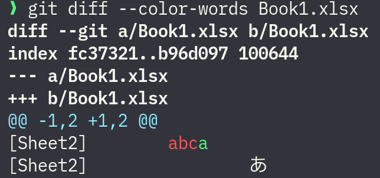
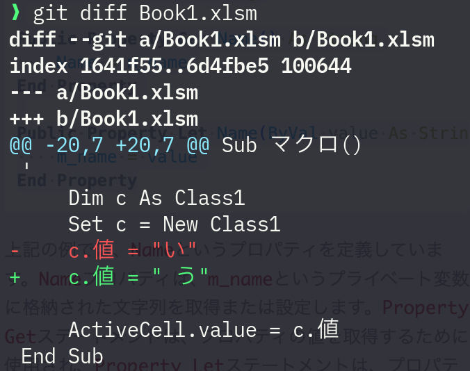

# xlconv

`xlconv` convert an Excel file (xlsx, xlsm, xls, ...) to text like ("▸" means tab)
```
[Sheet1]cellA1▸ cellB1
[Sheet1]cellA2▸ cellB2
...
```

This tool inspired by [git-xlsx-textconv](https://github.com/tokuhirom/git-xlsx-textconv).

In Git's diff, there is a feature called textconv,
which allows you to compare Excel files in a text-based format using xlconv.



`xlconv` can also read VBA (Japanese)!



## Setup

(1) Download xlconv binary from [Releases](./releases) and store it in a folder that is added to your PATH.

(2) Edit (or create if not exist) ~/.config/git/attributes (global) or {GIT_PROJECT}/.gitattributes (per project)

```
*.xlsx diff=xlsx
*.xlsm diff=xlsx
*.xls  diff=xlsx
```

(3) Edit ~/.gitconfig (global)

```
[diff *.xlsx]
  textconv = xlconv
```

## Usage

Using the `--color-words` option makes the diff easier to read.

```sh
git diff --color-words Book1.xlsx
```

```sh
git log -p --color-words Book1.xlsx
```

## Licence

MIT Licence.
